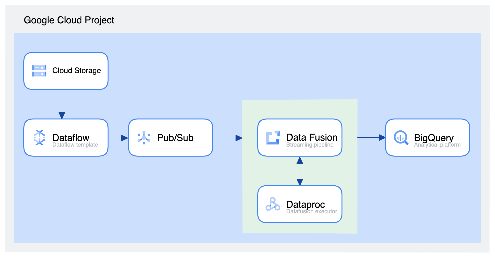
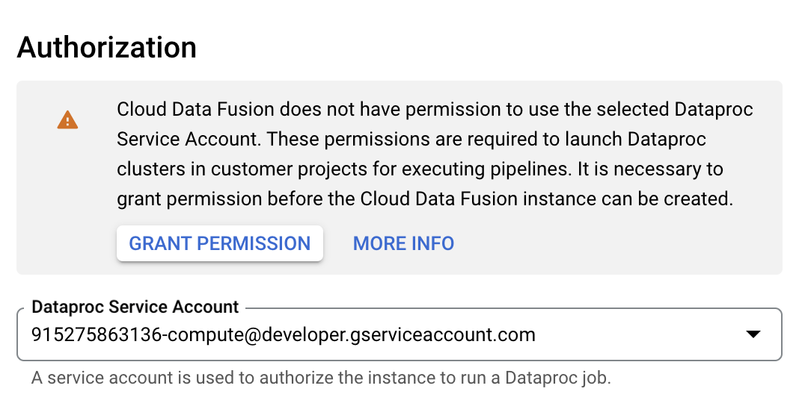

# GCP Streaming Workshop
 This lab is based on [Google Cloud Skills Boost](https://www.cloudskillsboost.google/focuses/12365?parent=catalog)

## Components diagram:


[Sample tweets data](https://storage.googleapis.com/cloud-training/OCBL164/pubnub_tweets_2019-06-09-05-50_part-r-00000)

## DataFusion Authorization configuration:
You have to press "Grant permission" button


## DataFusion:
## Wrangler commands #1:

```
columns-replace s/^body_payload_//g
drop id_str
parse-as-simple-date :created_at EEE MMM dd HH:mm:ss Z yyyy
drop display_text_range
drop truncated
drop in_reply_to_status_id_str
drop in_reply_to_user_id_str
parse-as-json :user 1
drop coordinates
set-type :place string
drop geo,place,contributors,is_quote_status,favorited,retweeted,filter_level,user_id_str,user_url,user_description,user_translator_type,user_protected,user_verified,user_followers_count,user_friends_count,user_statuses_count,user_favourites_count,user_listed_count,user_is_translator,user_contributors_enabled,user_lang,user_geo_enabled,user_time_zone,user_utc_offset,user_created_at,user_profile_background_color,user_profile_background_image_url,user_profile_background_image_url_https,user_profile_background_tile,user_profile_link_color,user_profile_sidebar_border_color,user_profile_sidebar_fill_color,user_profile_text_color,user_profile_use_background_image
drop user_following,user_default_profile_image,user_follow_request_sent,user_notifications,extended_tweet,quoted_status_id,quoted_status_id_str,quoted_status,quoted_status_permalink
drop user_profile_image_url,user_profile_image_url_https,user_profile_banner_url,user_default_profile,extended_entities
fill-null-or-empty :possibly_sensitive 'false'
set-type :possibly_sensitive boolean
drop :entities
drop :user_location
```

## Wrangler commands #2:
```
keep :message
set-charset :message 'utf-8'
rename :message :body
```

